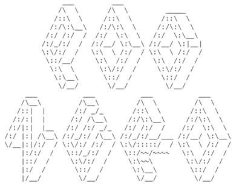

# Pod Zero

Pod Zero is a personal data vault architecture, built using [Solid](https://solidproject.org/developers/), that interprets users as autonomous agents in a formally open web, as a form of political-economic self-organisation ***designed to be formally commensurate to the cascade of negative synergies around climate change.***

While the complexity of this cascade of shocks is formally beyond the capacity of conventional institutional design, an agent-based mode of dynamic social organisation using Solid is formally capable of addressing this complexity.

In practise, this means:

- *developing the open web as a critical component enabling **emergent adaptation to climate change***
- *providing humans with the **legal status and functional capabilities of autonomous agents in a formally open web***
-*interpreting human rights and the UN's SDGs and capabilities frameworks in terms of autonomous agents in a formally open web* 
- *accelerating the **widespread adoption of the open web platform over commercial silos for personal and organisational data***

Because it centers on human rights, this project is named Pod Zero, the Solid communities' term for *the most local and personal form of data vault.*
